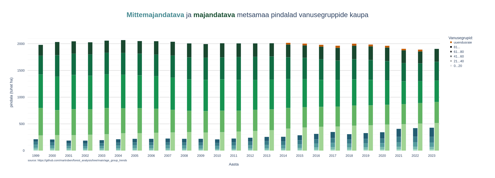

# Age Group Trend Analysis

This project analyzes Estonian forest areas by age groups using [Estonian National Forest Inventory](https://keskkonnaportaal.ee/et/teemad/mets/metsastatistika-sh-smi) data. It visualises the distribution between protected and production forests across different age categories.

## Data Sources
- Age group data: [Forest Age Classes](https://tableau.envir.ee/views/SMI/17Vanuseklassidaegrida?%3Aembed=y)
- Cutting areas: [Forest Cutting Statistics](https://tableau.envir.ee/views/SMI/28Raieaegrida?%3Aembed=y)

## Example Output


Results by tree species:
- [aspen](result/metsamaa_pindala_haab.png)
- [birch](result/metsamaa_pindala_kask.png)
- [black alder](result/metsamaa_pindala_sanglepp.png)
- [grey alder](result/metsamaa_pindala_hall_lepp.png)
- [pine](result/metsamaa_pindala_mänd.png)
- [spruce](result/metsamaa_pindala_kuusk.png)
- [other tree species](result/metsamaa_pindala_muu.png)

## Project Structure
```
.
├── README.md
├── data/
│   ├── raw/      # Source data files
│   ├── clean/    # Processed data
│   └── plot/     # Visualisation data
├── result/       # Sample result plots
└── src/
    ├── __init__.py           # System file for Python module system
    ├── clean_data.py         # Data cleaning
    ├── prepare_data.py       # Data formatting
    ├── plot_data.py          # Visualisation
    └── main.py               # Main
```

## Installation

1. Clone repo:
```shell
git clone https://github.com/martroben/forest_analysis/
```

2. Setup virtual environment
```shell
cd forest_analysis
python -m venv .venv
source .venv/bin/activate
```

3. Install dependencies
```shell
pip install -r requirements.txt
```

4. Optional: Update source data
    - Download latest data from sources to `data/raw/`
    - Update input filenames in `src/main.py`

5. Optional: Set tree species in `src/main.py`. Update parameters:
    - `TREE_SPECIES`
    - `PLOT_SAVE_PATH`
    - `PLOT_TITLE`

6. Generate visualisation:
```shell
python age_group_trends/src/main.py
```

## Libraries
- [`plotly`](https://plotly.com/python/) for visualisation
- [`polars`](https://pola.rs/) for data processing

## Limitations
- Production forest category also includes semi-restricted production areas. Source data does not allow for different grouping.
- Only regeneration cutting areas are included in analysis. Other types of cutting (thinning etc.) are not.
- Regeneration cutting statistics are only available from 2014 onwards.
- It is assumed that regeneration cutting in protected forests is negligible (taken to be 0 on the plot). Source data does not allow separating by protection status.
