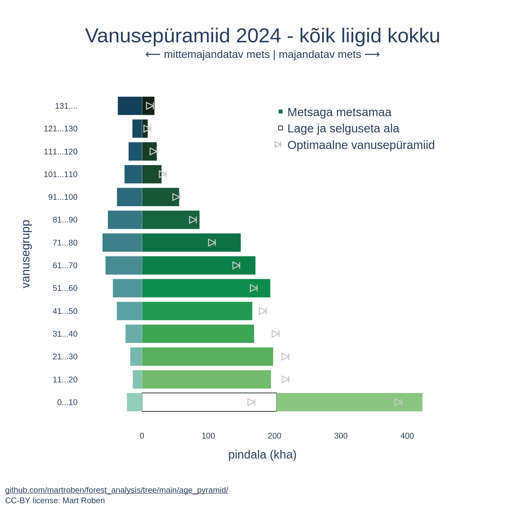

## Example Output


## Results by tree species
- [aspen](result/haab/)
- [birch](result/kask/)
- [black alder](result/sanglepp/)
- [grey alder](result/hall_lepp/)
- [pine](result/mänd/)
- [spruce](result/kuusk/)
- [other tree species](result/teised/)
- [all](result/kõik_liigid_kokku/)

## Data Sources
- [Areas by age group](https://tableau.envir.ee/views/SMI/17Vanuseklassidaegrida?%3Aembed=y)
- [Areas by quality class](https://tableau.envir.ee/views/SMI/14Boniteediklassid?%3Aembed=y)
- Maturity ages:
    - [1993-1998](http://www.zbi.ee/talkk/materjalid/TA%20LKK%20290508%20Rainer%20Kuuba.pdf#page=28) (p.28)
    - [1999-2006](https://www.riigiteataja.ee/akt/33469) (§13 pt.4)
    - [2007-2017](https://www.riigiteataja.ee/akt/12771900) (§3 pt.3)
    - [2018...](https://www.riigiteataja.ee/akt/130082017018) (§3 pt.1^2)

## Project Structure
```
.
├── README.md                                   # Current file. Project overview and instructions
├── data/                                       # Data
│   ├── raw/                                    # Original downloaded data
│   └── clean/                                  # Cleaned data
├── result/                                     # Resulting plots
└── src/                                        # Scripts
    ├── 01_clean_area_by_age_group.py           # Clean area-by-age-group inputs
    ├── 02_clean_area_by_quality_class.py       # Clean quality class inputs
    ├── 03_clean_maturity_ages.py               # Prepare maturity age table
    ├── 04_get_optimal_age_pyramid_areas.py     # Compute optimal pyramid areas per species
    ├── 05_plot_optimal_age_pyramid.py          # Plot optimal age pyramid figures
    ├── 06_plot_real_age_pyramid.py             # Plot the observed/real age pyramid
    └── 99_orchestator.py                       # Script to run the whole pipeline
```

## Deploy & run

1. Clone repo:
    ```shell
    git clone https://github.com/martroben/forest_analysis/
    ```

2. Set up virtual environment
    ```shell
    cd forest_analysis
    python -m venv .venv
    source .venv/bin/activate
    ```

3. Install dependencies
    ```shell
    pip install -r requirements.txt
    ```

4. Optional: dowload updated input files to `/data/raw/` and update the input in `src/99_orchestrator.py` accordingly.

5. Run the orchestrator script:
    ```shell
    python age_pyramid/src/99_orchestrator.py
    ```

Results are saved to the [`result/`](result) directory.

## Main libraries
- [`plotly`](https://plotly.com/python/) for visualisation
- [`polars`](https://pola.rs/) for data processing
- [`tqdm`](https://tqdm.github.io/) for progress bars

## Limitations
The analysis relies on several optimistic assumptions. Here's an incomplete list:
- Production forest category also includes semi-restricted production areas. Source data does not allow for different grouping.
- When calculating the maturity age, only the dominant species is taken into account. If secondary species exist, the maturity age is actually a combination of the different species.
- The analysis assumes that all areas of the same dominant species and quality class are interchangeable. However, they could have different volume (growing stock).
- The optimal areas aggregation assumes that all quality classes are worth cutting.
- Non-renewed proportion is assumed to be the same across all quality classes and species. It's most likely not.
- The law also allows to establish maturity when trees reach a certain diameter. Here only ages are used.
- Forest quality class can change after renewal cutting. Here, it is assumed to stay constant.
- Optimal area assumes stable mature area each year, but not stable revenue. There could be periods of high and low wood prices.
- The values of non-renewed proportion and annual mature cut proportion are eyeballed to match the age pyramid with all species across all years.
- It is assumed that non-renewed areas are distributed proportionally across quality classes. There is no input data for the actual distribution.
