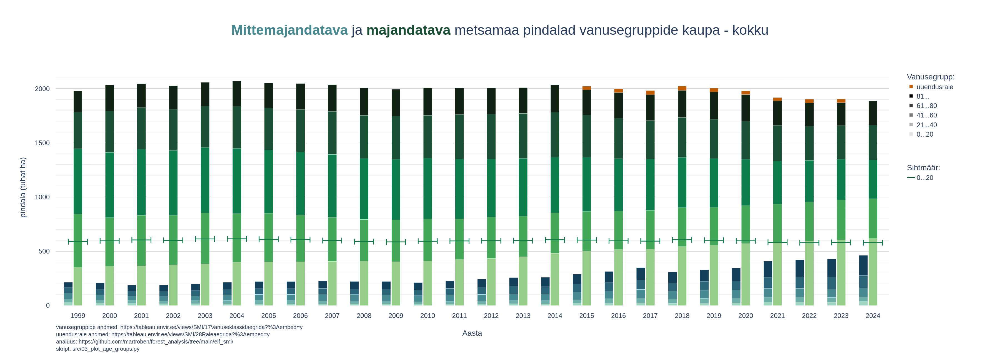

# 

This project adds context to the Estonian Fund for Nature [op-ed article in ERR.ee](https://www.err.ee/1609804380/eliisa-pass-statistika-kinnitab-eesti-metsade-uleraiet) published on 2025-09-18.

## Data Sources
- Age group data: [Forest Age Classes](https://tableau.envir.ee/views/SMI/17Vanuseklassidaegrida?%3Aembed=y)
- Cutting areas: [Forest Cutting Statistics](https://tableau.envir.ee/views/SMI/28Raieaegrida?%3Aembed=y)

## Example Output


Results by tree species:
- [aspen](result/metsamaa_pindala_haab.png)
- [birch](result/metsamaa_pindala_kask.png)
- [black alder](result/metsamaa_pindala_sanglepp.png)
- [grey alder](result/metsamaa_pindala_hall_lepp.png)
- [pine](result/metsamaa_pindala_mänd.png)
- [spruce](result/metsamaa_pindala_kuusk.png)
- [other tree species](result/metsamaa_pindala_muu.png)

## Project Structure
```
.
├── README.md                   # Project overview and instructions
├── data/
│   ├── raw/                    # Source data files (downloaded from official sources)
│   └── clean/                  # Cleaned and preprocessed data for analysis
├── result/                     # Output plots and figures generated by scripts
└── src/
    ├── clean/
    │   ├── __init__.py         # Marks 'clean' as a Python module
    │   └── clean.py            # Data cleaning functions/scripts
    ├── plot/
    │   ├── __init__.py         # Marks 'plot' as a Python module
    │   └── plot.py             # Plotting and visualization functions
    ├── 01_clean_age_groups.py  # Clean age group raw data and save it to clean
    └── 02_plot_age_groups.py   # Plot age group data and save png plots to results
```

## Installation

1. Clone repo:
```shell
git clone https://github.com/martroben/forest_analysis/
```

2. Set up virtual environment
```shell
cd forest_analysis
python -m venv .venv
source .venv/bin/activate
```

3. Install dependencies
```shell
pip install -r requirements.txt
```

4. Generate age group plots:
```shell
python elf_smi/src/01_clean_age_groups.py
python elf_smi/src/02_plot_age_groups.py
```

Result is saved to `elf_smi/result`

## Libraries
- [`plotly`](https://plotly.com/python/) for visualisation
- [`polars`](https://pola.rs/) for data processing

## Limitations
- Production forest category also includes semi-restricted production areas. Source data does not allow for different grouping.
- Only regeneration cutting areas are included in analysis. Other types of cutting (thinning etc.) are not.
- Regeneration cutting statistics are only available from 2015 onwards.
- It is assumed that regeneration cutting in protected forests is negligible (taken to be 0 on the plot). Source data does not allow separating by protection status.
